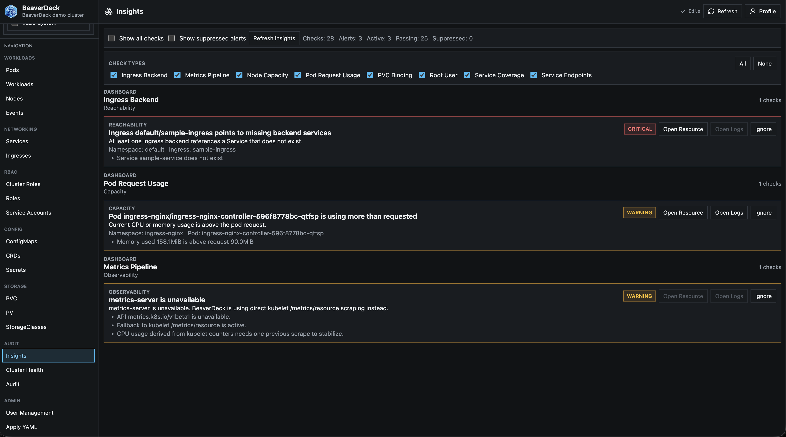
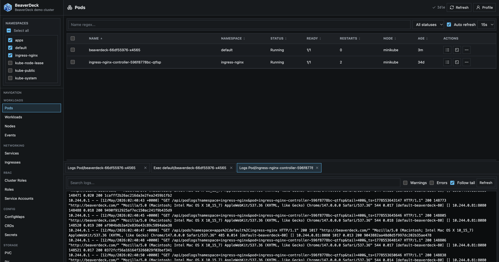

[](https://artifacthub.io/packages/search?repo=beaverdeck)

# BeaverDeck

BeaverDeck is a lightweight Kubernetes operations, optimization and triage tool for inspecting cluster state, troubleshooting workloads, and performing common day-2 actions from a single web UI.
Its default Dashboard summarizes visible cluster health, capacity, events, and Insights, while the categorized Insights workflow lets operators drill into manifests, logs, exec sessions, and remediation actions from the same UI.

## Quick Start

Install with Helm. BeaverDeck stores auth configuration in a Kubernetes Secret and uses `DATA_DIR` only for non-auth runtime metadata.

```bash
helm upgrade --install beaverdeck oci://ghcr.io/arequs/charts/beaverdeck \
  --namespace beaverdeck \
  --create-namespace \
  --set clusterName=your-cluster-name
```

Enable chart persistence only if you want non-auth runtime metadata, such as update-check status, to survive pod restarts.
If you do not expose the app through ingress, port-forward it:

```bash
kubectl -n beaverdeck port-forward svc/beaverdeck 8080:80
```

Then open `http://localhost:8080`. On first start, BeaverDeck asks for the initial admin username and password.

See chart details on [Artifact Hub](https://artifacthub.io/packages/search?repo=beaverdeck).

## Dashboard

Every signed-in user lands on Dashboard. It combines a role-scoped health score with node and pod readiness, CPU and memory capacity bars, workload and PVC readiness, pod status distribution, top pod consumers, recent warning events, object inventory, and an Insights summary.

Dashboard does not introduce a separate permission. It is always present in the top-level navigation, but each panel and API request is enabled only when the signed-in role has View access to the underlying resource and selected namespace. Panels update independently as their data arrives. Insights categories are included only when the role can also view the source resources needed to calculate them and are evaluated together in one shared cluster scan; users without matching permissions see no data from those resources.

## Insights-First Triage



BeaverDeck is built around the Insights workflow. Instead of starting from raw object tables, operators can begin with grouped alerts and health signals, then open the exact resource, logs, or manifest connected to the finding.

Insights are split into focused categories:

- Nodes: readiness, pressure conditions, metrics availability, requested-resource capacity, and underutilization signals
- Workloads: pod and controller health, restart patterns, pending or unhealthy pods, and resource request pressure
- GPU: GPU capacity discovery, allocation pressure, pending GPU workloads, and GPU node workload mix
- Networking: ingress and service signals that help narrow traffic-routing issues
- Storage: PVC binding state, volume usage, storage class visibility, and persistent storage pressure
- Security: pod security context, sensitive literal environment variables, and NetworkPolicy coverage
- Configuration: missing Secret and ConfigMap references

Each category loads only the Kubernetes data needed for that view, so looking at Node Insights does not trigger pod-heavy checks unless that category needs them.
This keeps the product fast on larger clusters and makes the troubleshooting path more predictable.

## Operations Workspace

After an Insight points to a likely issue, BeaverDeck provides the operational tools needed to confirm and act:

- browse cluster objects: pods, workloads, nodes, services, ingresses, config maps, secrets, PVCs, PVs, storage classes, CRDs and their custom resources, Helm releases, Argo CD applications, and events
- inspect manifests as YAML
- edit resources and apply changes through server-side apply
- view pod and workload logs
- open `exec` sessions into running pods
- run common operational actions such as scale, restart, delete, evict, drain, and uncordon
- start from an RBAC-scoped Dashboard with health, capacity, readiness, warning-event, inventory, and Insights summaries
- review category-scoped operational insights for nodes, workloads, GPU, networking, storage, security, and configuration
- keep access controlled with users, roles, and namespace-scoped permissions

The CRDs navigation item expands into the definitions available in the cluster. Custom resources are listed only from namespaces allowed by the signed-in user's BeaverDeck role; cluster-scoped custom resources remain cluster-scoped. The chart ServiceAccount has wildcard get/list/create/update/patch/delete access across API groups and resources because Kubernetes RBAC cannot predeclare resource names for arbitrary installed CRDs, while BeaverDeck's own RBAC remains the user-facing authorization boundary.

The Applications workspace contains separate expandable trees for Helm Releases and Argo CD Applications. Helm releases are populated from Helm 3 Secret or ConfigMap storage; Argo CD applications are read directly from `applications.argoproj.io` resources when the CRD is installed. Selecting an item opens its revision or deployment history and current status. Users with `applications: edit` (Manage in the role UI) can inspect Helm values and rendered resources, or an Argo CD revision's source configuration and the current revision's created-resource inventory, in the same bottom YAML dock used for Kubernetes manifests. Missing permissions, including roles created by older BeaverDeck versions, normalize to None; grant `applications: view` explicitly to show the section. Both providers are queried only in namespaces allowed by the signed-in user's role. Stored Helm notes and hooks are not exposed, and this workflow does not trigger Argo CD sync, rollback, or deletion operations.

Restart Diagnostics is an incident-reconstruction feature rather than a monitoring backend. BeaverDeck samples pod-container and node CPU/memory into a bounded in-memory ring, detects restart and eviction transitions through a Kubernetes watch, and overwrites one versioned Kubernetes Secret per pod with the latest snapshot. The Secret is named `beaverdeck-restart-<pod-name>`; older workload/container-scoped diagnostic Secrets are consolidated automatically. The Pods restart column links to the captured metrics, container limits, node usage plus allocatable/capacity totals, pods on the node, pod/node events, PVC/PV details and events, and timestamped previous logs for every container. Metrics Server is preferred with a direct kubelet resource-metrics fallback; unavailable inputs remain explicit partial data. No Prometheus, log backend, database, PVC for BeaverDeck, CRD, or message broker is required.

The Helm chart enables this by default. Configure it with `restartDiagnostics.*`, or set the equivalent environment variables `RESTART_DIAGNOSTICS_ENABLED`, `RESTART_DIAGNOSTICS_INTERVAL_SECONDS`, `RESTART_DIAGNOSTICS_HISTORY_MINUTES`, `RESTART_DIAGNOSTICS_MAX_LOG_LINES`, `RESTART_DIAGNOSTICS_MAX_LOG_BYTES_PER_CONTAINER`, `RESTART_DIAGNOSTICS_MAX_TOTAL_LOG_BYTES`, and `RESTART_DIAGNOSTICS_MAX_EVENTS`.



## Architecture

- Backend: Go
- Frontend: React + Vite
- Runtime mode: in-cluster only
- Authentication: local users, Google OAuth, generic OpenID Connect, and Azure Entra ID
- Auth configuration storage: Kubernetes Secret only
- Suppressed Insights storage: Kubernetes ConfigMap
- Local runtime metadata: SQLite in `DATA_DIR` for non-auth data such as update-check status

Bearer login tokens are signed in memory and are not stored server-side. A pod restart requires users to sign in again.

## Authentication Configuration

Configure authentication from the Admin UI after the first local admin user is initialized.

### Auth Configuration Secret

On startup, BeaverDeck reads its auth configuration from a Kubernetes Secret. By default it uses `beaverdeck-config` in the pod namespace with data key `config.yaml`; override with `CONFIG_SECRET_NAME`, `CONFIG_SECRET_NAMESPACE`, and `CONFIG_SECRET_KEY` if needed.

If the Secret is missing, BeaverDeck starts the initialization screen and waits for the initial admin username and password in the UI. The Secret is created only after successful initialization. If the Secret exists, BeaverDeck imports it and logs the selected path. If startup import fails, the log includes the failed stage and BeaverDeck exits without overwriting the existing Secret. Fix the Secret content, or delete the Secret to start initialization again.

Admins can export and import the same YAML snapshot from the Admin UI. The snapshot includes local users, roles, Google OAuth, generic OIDC, and Azure Entra ID configuration and mappings. Generic OIDC and Entra use independent sections and can be enabled at the same time. Local user passwords are exported only as BeaverDeck password hashes, not raw passwords or base64-encoded passwords.

Example Secret:

```yaml
apiVersion: v1
kind: Secret
metadata:
  name: beaverdeck-config
  namespace: beaverdeck
type: Opaque
stringData:
  config.yaml: |
    schema_version: 1
    initialized: true
    roles:
      - name: admin
        mode: admin
      - name: dev
        mode: viewer
        permissions:
          namespaces:
            - apps
          resources:
            clusterroles: view
    users:
      - username: admin
        role: admin
        password_hash: bdk1$180000$<salt-hex>$<digest-hex>
    google:
      config:
        client_id: ""
        client_secret: ""
        hosted_domain: ""
        service_account_json: ""
        delegated_admin_email: ""
      mappings: []
    oidc:
      config:
        provider_name: OpenID Connect
        issuer_url: ""
        client_id: ""
        client_secret: ""
        scopes: openid email profile groups
        hosted_domain: ""
        email_claim: email
        groups_claim: groups
      mappings: []
    entra:
      config:
        provider_name: Azure Entra ID
        issuer_url: ""
        client_id: ""
        client_secret: ""
        scopes: openid email profile User.Read GroupMember.Read.All
        hosted_domain: ""
        email_claim: email
        groups_claim: groups
      mappings: []
```

Any role with `mode: "admin"` has full access; its `permissions` value is ignored. Non-admin roles are controlled by their `permissions`. If `permissions` is omitted, the role has no permissions. Resource permission values are compact levels: `view`, `edit`, or `full`.
For Secrets, `view` lists metadata only. Opening a Secret manifest, revealing decoded values, and editing require `secrets: edit`; deleting requires `secrets: full`. User and role administration always requires `mode: admin` and is not delegated through resource permissions.
Valid partial configuration Secrets are completed during startup import. For example, a Secret that contains only a local admin-mode user and one OIDC provider is normalized with the current schema version, default admin role, empty Google config, default OIDC and Entra fields, and empty mappings before it is persisted back to the Secret after successful import. Legacy Entra settings stored in the old shared `oidc` section are migrated automatically to `entra`.

### Suppressed Insights ConfigMap

Suppressed Insights are global for all users and are stored outside the auth Secret in a ConfigMap. The Helm chart creates it empty by default.

```yaml
apiVersion: v1
kind: ConfigMap
metadata:
  name: beaverdeck-suppressed-insights
  namespace: beaverdeck
data:
  suppressed_insights.json: "[]"
```

The value is a JSON array of Insight check keys. Missing or empty means all checks are enabled.
In the Helm chart, override `.Values.suppressedInsights.configMapName` or `.Values.suppressedInsights.key` if the default generated name/key is not suitable.

Generate a local user password hash with the BeaverDeck binary or image:

```bash
read -rsp 'Password: ' BDPASS
printf '%s' "$BDPASS" | docker run --rm -i arequs/beaverdeck:1.6.1 hash-password
unset BDPASS
```

Use the printed `bdk1$...` value as `password_hash`. Do not store raw passwords or base64-encoded passwords in the configuration Secret.

### Local Users and Roles

Local users are always available and are used for first initialization.
On first start, BeaverDeck asks for the initial admin username and password in the UI.
After initialization, admins can create local users, reset local passwords, and assign roles.

Roles can be namespace-scoped and can grant different access levels per resource area, including workloads, nodes, exec, apply, insights, users, and roles.

### Google OAuth

Google OAuth supports browser sign-in plus Google Workspace group-to-role mapping.
Configure:

- Google Client ID
- Google Client Secret
- optional Hosted Domain to restrict sign-in to one Workspace domain
- Delegated Admin Email for Google Admin Directory group lookup
- Service Account JSON with domain-wide delegation for group resolution

After saving the provider, configure Google group mappings with group email addresses such as `platform-admins@example.com`.
Mapped groups resolve to BeaverDeck roles during sign-in.

### OpenID Connect

Generic OpenID Connect uses provider discovery and maps roles from the configured groups claim.
It is configured independently from Azure Entra ID, so both sign-in methods can be active at the same time. Register `<BeaverDeck base URL>/api/auth/oidc/callback` as the provider callback URL.
Configure:

- Provider Name
- Issuer URL
- Client ID
- Client Secret
- Scopes, usually `openid email profile groups`
- optional Hosted Domain
- Email Claim, usually `email`
- Groups Claim, usually `groups`

Group mappings should match the exact group values returned by the provider in the configured groups claim.

### Azure Entra ID

Use an issuer URL in the form `https://login.microsoftonline.com/<tenant-id>/v2.0`.
Entra has its own configuration and group mappings, independent from generic OIDC. Keep `<BeaverDeck base URL>/api/auth/oidc/callback` registered as the Entra web redirect URI; BeaverDeck preserves this historical callback and selects the correct provider through an isolated OAuth state cookie.
For Microsoft Graph group lookup, include `User.Read` and `GroupMember.Read.All` in the configured scopes and grant the required Graph consent in Entra ID.
Group mappings can use the group object ID, display name, mail address, or security identifier returned by Microsoft Graph.

## Build Requirements

- Go 1.27rc3 or newer
- Node.js 22 or newer for frontend builds

## Repository Layout

- `cmd/server/` - backend entrypoint and embedded web assets
- `internal/api/` - HTTP and WebSocket handlers
- `internal/kube/` - Kubernetes client logic
- `internal/auth/` - auth middleware
- `internal/users/` - user and role storage
- `ui/` - React application
- `charts/beaverdeck/` - Helm chart

### Notes About RBAC

The chart installs a cluster-scoped RBAC policy because BeaverDeck can inspect and operate on cluster-wide resources such as:

- nodes
- PVs
- storage classes
- CRDs
- namespaces
- node proxy stats for storage usage
- metrics API for node and pod usage

If you want to reduce scope later, do it intentionally: the UI and API currently assume this broader visibility is available.
